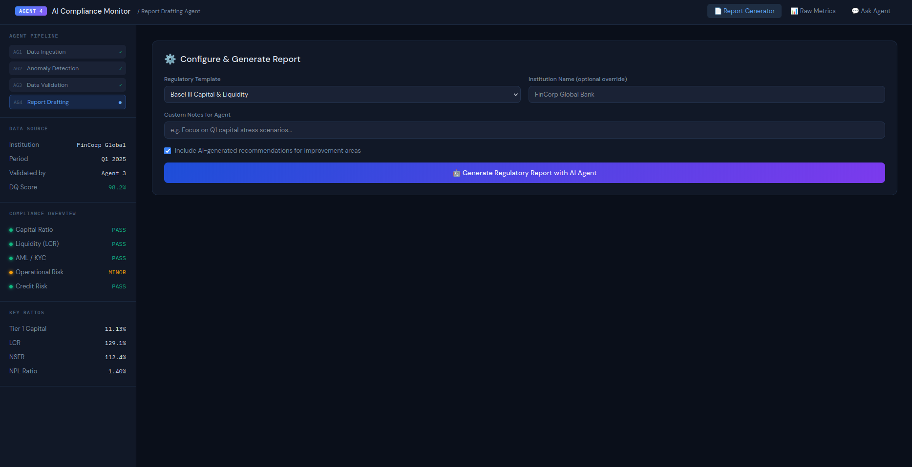
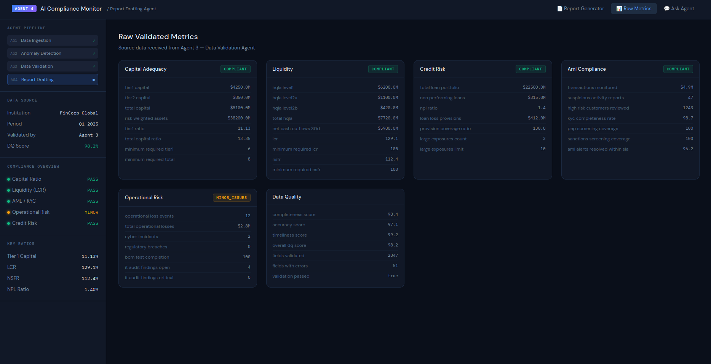
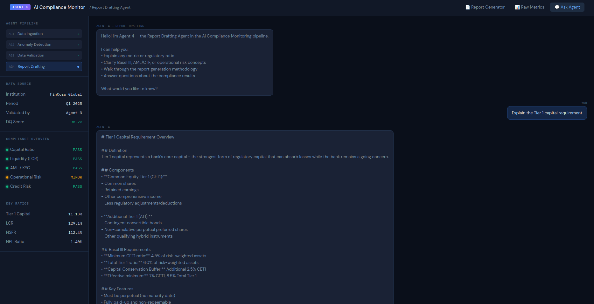

# 🤖 AI Compliance Monitoring — Agent 4: Report Drafting Agent

> **Interview Assignment** — AI-powered regulatory report generation using validated operational metrics.  
> *Disclaimer: For interview purposes only. Neither party owns any IP rights or claims.*

---

## 📋 Table of Contents

- [Overview](#overview)
- [Pipeline Architecture](#pipeline-architecture)
- [Screenshots](#screenshots)
- [Tech Stack](#tech-stack)
- [Project Structure](#project-structure)
- [Features](#features)
- [Architecture & Design](#architecture--design)
- [Setup & Installation](#setup--installation)
- [Running the Application](#running-the-application)
- [API Endpoints](#api-endpoints)
- [Report Structure](#report-structure)
- [Regulatory Templates](#regulatory-templates)
- [How to Test](#how-to-test)

---

## Overview

This project implements **Agent 4 — the Report Drafting Agent** in a 4-agent AI compliance monitoring pipeline. The agent receives validated operational metrics from Agent 3 (Data Validation Agent) and converts them into structured, professional regulatory compliance reports using Claude AI (claude-sonnet).

### Assignment Objectives
- ✅ Map validated data fields to regulatory reporting fields
- ✅ Aggregate and calculate compliance metrics
- ✅ Generate structured regulatory reports
- ✅ Handle missing or partial data gracefully
- ✅ Provide a working frontend dashboard for demonstration

---

## Pipeline Architecture

```
┌─────────────────────────────────────────────────────────────┐
│                  AI Compliance Monitoring Pipeline           │
├──────────┬──────────────────┬──────────────────┬────────────┤
│ Agent 1  │    Agent 2       │    Agent 3       │  Agent 4   │
│          │                  │                  │            │
│  Data    │   Anomaly        │    Data          │  Report    │
│Ingestion │   Detection      │  Validation      │ Drafting   │
│          │                  │                  │  ← HERE    │
│  Raw     │  Flags           │  Validated       │ Regulatory │
│  Data  → │  Anomalies     → │  Metrics       → │  Reports   │
└──────────┴──────────────────┴──────────────────┴────────────┘
```

Agent 4 receives a validated dataset (DQ Score: 98.2%) from Agent 3 and uses Claude AI to:
1. Map internal fields → regulatory fields
2. Calculate aggregated compliance ratios
3. Draft section-level narratives and recommendations
4. Produce a submission-ready structured report

---

## Screenshots

### 📄 Report Generator
Configure regulatory template, institution, and generate AI-drafted reports.



---

### 📊 Raw Validated Metrics
Explore all validated metrics received from Agent 3 — organized by compliance domain.



---

### 💬 Ask Agent (Chat Interface)
Chat with Agent 4 to ask questions about compliance metrics, regulations, and methodology.



---

## Tech Stack

| Layer | Technology |
|-------|-----------|
| **AI Model** | Claude Sonnet (`claude-sonnet-4-20250514`) via Anthropic API |
| **Backend** | Python — FastAPI |
| **Frontend** | Vanilla HTML/CSS/JavaScript (no build step needed) |
| **API Server** | Uvicorn (ASGI) |
| **Environment** | python-dotenv |
| **HTTP Client** | Fetch API (browser-native) |

---

## Project Structure

```
compliance-agent/
│
├── backend/
│   ├── main.py              ← FastAPI app — all routes + AI logic
│   └── requirements.txt     ← Python dependencies
│
├── frontend/
│   └── index.html           ← Full dashboard (single file, no build needed)
│
├── screenshots/
│   ├── screenshot-report-generator.png
│   ├── screenshot-raw-metrics.png
│   └── screenshot-ask-agent.png
│
├── .env                     ← API key (not committed — see .gitignore)
├── .gitignore
├── start.sh                 ← One-command startup script
└── README.md
```

---

## Features

### 🗂️ Three Dashboard Views

| View | Description |
|------|-------------|
| **Report Generator** | Select template, configure options, generate AI-drafted report |
| **Raw Metrics** | Browse all validated metrics received from Agent 3 by domain |
| **Ask Agent** | Chat with Agent 4 to understand metrics, regulations, methodology |

### 📋 Report Capabilities
- **4 Regulatory Templates**: Comprehensive, Basel III, AML/CTF, Operational Risk
- **Section-level compliance scoring** (0–100%) with PASS / FAIL / WARNING per metric
- **Field mapping table**: internal field → regulatory field → value → threshold → status
- **AI-generated narratives** per section explaining compliance posture
- **Recommendations** for any areas needing improvement
- **Data Quality Assessment** block (completeness, accuracy, timeliness)
- **Certification block** with submission-readiness flag

### 🔁 Agent Pipeline Sidebar
Shows the live status of all 4 agents in the pipeline — Agent 4 highlights as active during generation.

---

## Architecture & Design

### Template Mapping Approach

Each regulatory template defines a set of sections. The agent maps internal metric fields to their regulatory equivalents:

| Internal Field | Regulatory Field | Template |
|---|---|---|
| `tier1_capital` | CET1 Capital | Basel III |
| `tier1_ratio` | Tier 1 Capital Ratio | Basel III |
| `lcr` | Liquidity Coverage Ratio | Basel III |
| `suspicious_activity_reports` | SAR Count | AML/CTF |
| `kyc_completeness_rate` | CDD Completion Rate | AML/CTF |
| `operational_loss_events` | Operational Loss Events | Op Risk |

### Report Generation Flow

```
User selects template
        ↓
Backend receives validated metrics (from Agent 3)
        ↓
Structured prompt sent to Claude Sonnet with:
  - Full metrics JSON
  - Template requirements
  - Regulatory references
  - Output schema
        ↓
Claude returns structured JSON report
        ↓
Frontend renders: header → summary cards → sections → DQ → certification
```

### Handling Missing or Partial Data
- Fields with no value render as `N/A` in the metrics table
- Agent prompt instructs Claude to note data gaps in the `data_quality_assessment.data_gaps` array
- `submission_ready` in the certification block is set to `false` if critical fields are missing
- DQ score from Agent 3 is propagated and displayed in every report

---

## Setup & Installation

### Prerequisites
- Python 3.9+
- An Anthropic API key — get one at [console.anthropic.com](https://console.anthropic.com)

### 1. Clone the repository

```bash
git clone https://github.com/ABHAY1937/compliance-agent.git
cd compliance-agent
```

### 2. Install Python dependencies

```bash
pip install -r backend/requirements.txt
```

### 3. Configure your API key

Create a `.env` file inside the `backend/` folder:

```bash
# backend/.env
ANTHROPIC_API_KEY=sk-ant-your-key-here
```

Then update `backend/main.py` to load it (if not already done):

```python
from dotenv import load_dotenv
import os

load_dotenv()
client = anthropic.Anthropic(api_key=os.getenv("ANTHROPIC_API_KEY"))
```

---

## Running the Application

### Option A — One command (recommended)

```bash
bash start.sh
```

### Option B — Manual

**Terminal 1 — Start the backend:**
```bash
cd backend
uvicorn main:app --host 0.0.0.0 --port 8000 --reload
```

**Terminal 2 — Serve the frontend:**
```bash
cd frontend
python -m http.server 3000
```

Then open **http://localhost:3000** in your browser.

---

## API Endpoints

| Method | Endpoint | Description |
|--------|----------|-------------|
| `GET` | `/` | Health check |
| `GET` | `/metrics` | Returns validated metrics from Agent 3 |
| `GET` | `/templates` | Lists available regulatory templates |
| `POST` | `/generate-report` | Generates AI-drafted compliance report |
| `POST` | `/chat` | Chat with Agent 4 |
| `GET` | `/docs` | Swagger UI — interactive API explorer |

### Generate Report — Request Body

```json
{
  "template_type": "COMPREHENSIVE",
  "institution_name": "FinCorp Global Bank",
  "custom_notes": "Focus on Q1 capital stress scenarios",
  "include_recommendations": true
}
```

`template_type` options: `COMPREHENSIVE`, `BASEL_III`, `AML_CTF`, `OPERATIONAL_RISK`

---

## Report Structure

The generated report is a structured JSON object:

```json
{
  "report_metadata": {
    "report_id": "RPT-2025-...",
    "report_title": "Comprehensive Regulatory Compliance Report",
    "institution": "FinCorp Global Bank",
    "reporting_period": "Q1 2025",
    "overall_compliance_status": "COMPLIANT",
    "overall_compliance_score": 91,
    "agent_id": "Agent-4-ReportDrafter"
  },
  "executive_summary": {
    "summary_text": "...",
    "key_findings": ["..."],
    "critical_alerts": []
  },
  "sections": [
    {
      "section_id": "S001",
      "section_name": "Capital Adequacy",
      "regulatory_reference": "Basel III — Article 92",
      "compliance_status": "COMPLIANT",
      "compliance_score": 95,
      "metrics": [
        {
          "field_name": "Tier 1 Capital Ratio",
          "regulatory_field": "CET1 Ratio",
          "value": "11.13",
          "threshold": "6.0%",
          "unit": "%",
          "status": "PASS"
        }
      ],
      "section_narrative": "...",
      "recommendations": ["..."]
    }
  ],
  "data_quality_assessment": {
    "overall_score": 98.2,
    "completeness": 98.4,
    "accuracy": 97.1,
    "timeliness": 99.2,
    "data_gaps": [],
    "notes": "..."
  },
  "certification": {
    "prepared_by": "Agent 4 - Report Drafting Agent",
    "validated_by": "Agent 3 - Data Validation Agent",
    "submission_ready": true
  }
}
```

---

## Regulatory Templates

| Template | Regulator | Sections Covered |
|----------|-----------|-----------------|
| **Comprehensive** | Multiple | Capital, Liquidity, Credit Risk, AML/CTF, Operational Risk |
| **Basel III** | BIS / Central Bank | Capital Adequacy, LCR, NSFR |
| **AML/CTF** | Financial Intelligence Unit | Transaction Monitoring, KYC/CDD, SAR Filing, Sanctions |
| **Operational Risk** | Prudential Regulatory Authority | Loss Events, Cyber Security, BCM, IT Audit |

---

## How to Test

### In the Browser

1. Open **http://localhost:3000**
2. **Report Generator tab** → Select "Comprehensive" → Click Generate → Expand sections
3. **Raw Metrics tab** → Verify all 6 metric blocks load (Capital, Liquidity, Credit, AML, Ops, DQ)
4. **Ask Agent tab** → Try: *"What is the LCR ratio and is it compliant?"*

### Swagger UI
Visit **http://localhost:8000/docs** to test all API endpoints interactively.

### curl
```bash
# Health check
curl http://localhost:8000/

# Generate a Basel III report
curl -X POST http://localhost:8000/generate-report \
  -H "Content-Type: application/json" \
  -d '{"template_type": "BASEL_III", "include_recommendations": true}'
```# compliance-agent
